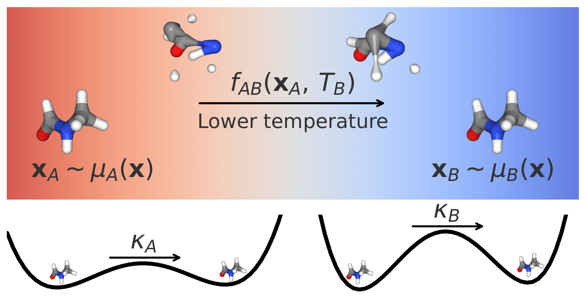

# Thermodynamic Interpolation

This repository contains an implementation of methods and experiments presented in the paper [Thermodynamic Interpolation: A generative approach to molecular thermodynamics and kinetics](https://pubmed.ncbi.nlm.nih.gov/39988824/).



## Installation
Follow the below steps to set up environments and install the required dependencies.

### Cloning the repository
Run the following in a terminal.
```
git clone git@github.com:olsson-group/thermodynamic-interpolation.git
cd thermodynamic-interpolants
```

### Installing dependencies
We have provided two installation files to reproduce our Conda environments. To install an environment for general use throughout this repository, run the following
```
conda env create -f ti_env.yml
```

In some cases the general purpose environment is not sufficent. To avoid package incompatibilities, we used a second environment when evaluating energies. To reproduce this environment, run the following
```
conda env create -f ti_energy_env.yml
```

## General Usage
This repository contains experiments for both the lower-dimesnional double well system and molecular data. Our model weights for the molecular systems can be found [here](https://zenodo.org/records/14958780). Since the training and evaluation data files are too large to upload, please contact the authors for access. 

### Asymmetric double well
The folder "adw/" contains code for experiments related to the Asymmetric Double Well potential. 

### Molecular data
The folder "mdqm9/" contains code for experiments related to the molecular data.


## Citations
To cite this work, please use the following
```
@article{Moqvist2025,
  title = {Thermodynamic Interpolation: A Generative Approach to Molecular Thermodynamics and Kinetics},
  ISSN = {1549-9626},
  url = {http://dx.doi.org/10.1021/acs.jctc.4c01557},
  DOI = {10.1021/acs.jctc.4c01557},
  journal = {Journal of Chemical Theory and Computation},
  publisher = {American Chemical Society (ACS)},
  author = {Moqvist,  Selma and Chen,  Weilong and Schreiner,  Mathias and N\"{u}ske,  Feliks and Olsson,  Simon},
  year = {2025},
  month = feb 
}
```


